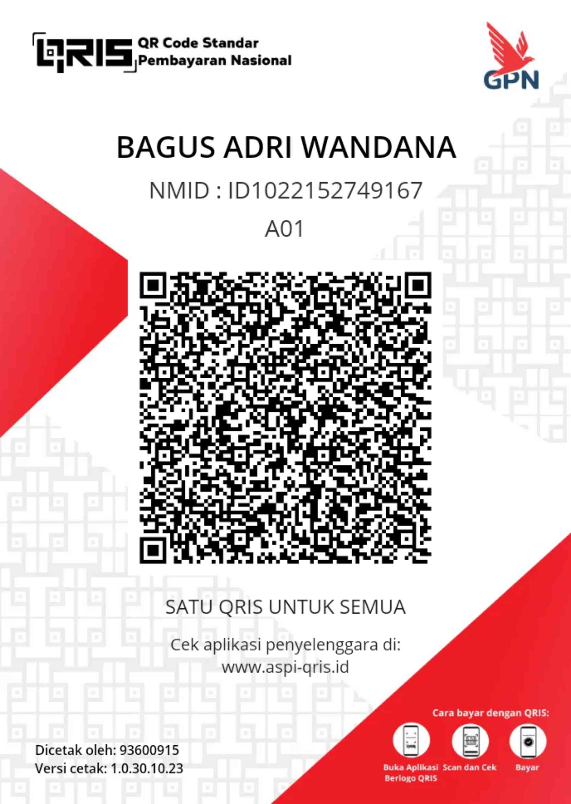

<html>
  <head>
    <title>Ngemis Online</title>
    <meta name="viewport" content="width=device-width, initial-scale=1.0" />
    
  </head>
  <body>
    

      <h1>MISOL</h1>
      
Ngemis Online :v

      <button id="start" onclick="startTest()">Next</button>
      <h1>Tes Introvert atau Ekstrovert</h1>
      

        

          APAKAH ANDA MERASA LEBIH ENERGIK SAAT BERINTERAKSI DENGAN BANYAK ORANG
          (ya) atau saat anda sendiri atau bersama teman-teman dekat (tidak)?
        

        <button id="yes" onclick="nextQuestion('ya')">YA</button>
        <button id="no" onclick="nextQuestion('tidak')">TIDAK</button>
      

      

        
         
        

        <button id="next" onclick="showQRIS()">Next</button>
      

      

        
      

    

    
  </body>
</html>
